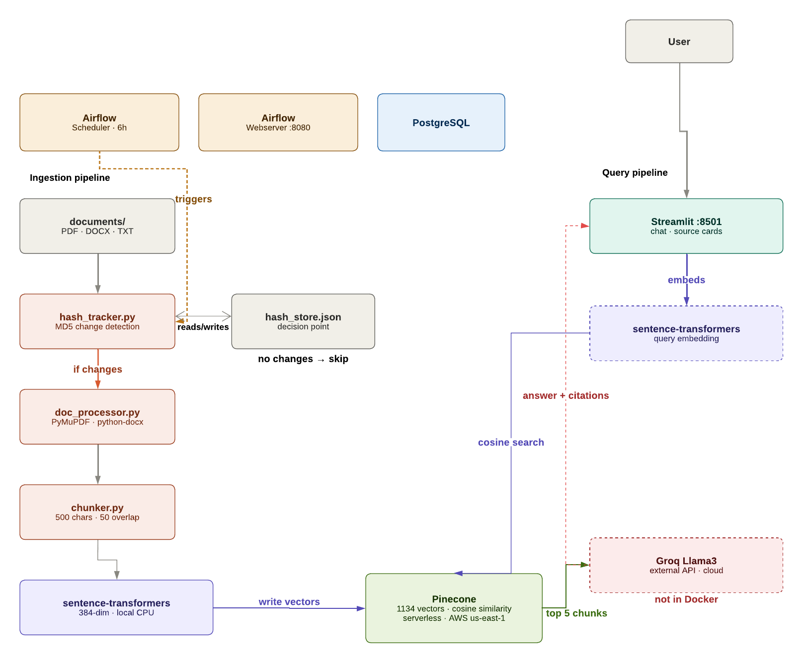
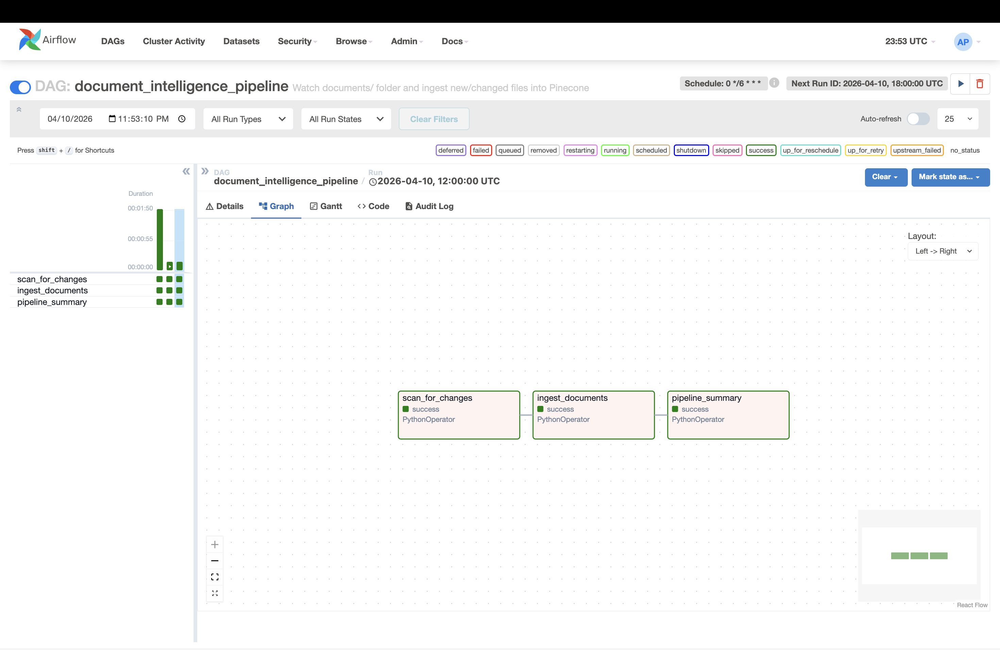
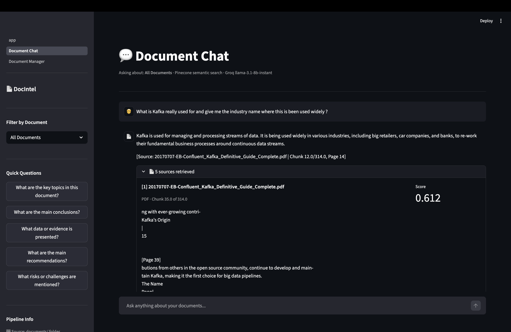
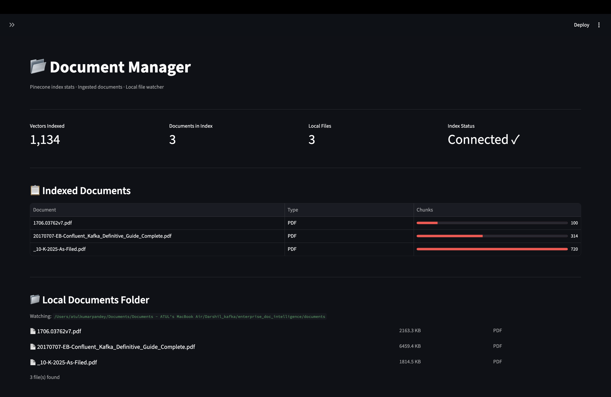
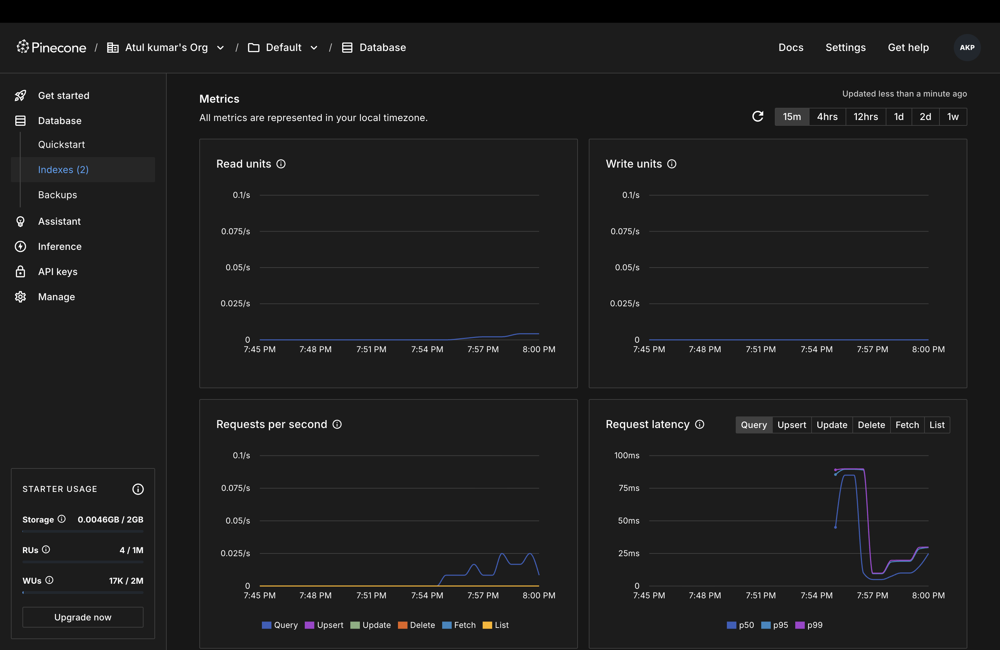

<div align="center">

# Enterprise Document Intelligence

**Drop any document. Ask any question. Get grounded answers with citations.**

[](https://python.org)
[](https://airflow.apache.org)
[](https://pinecone.io)
[](https://groq.com)
[](https://docker.com)
[](https://streamlit.io)

<br/>

> *Supports PDF · Word (.docx) · Plain Text (.txt)*
> *Semantic search · MD5 change detection · Airflow orchestration*

</div>

---

## Architecture

<div align="center">
  
  <br/>
  <sub>Full pipeline from document drop to grounded AI answer</sub>
</div>

---

## Pipeline in Action

<table>
  <tr>
    <td width="50%">
      
      <p align="center"><sub><b>Airflow DAG — all 3 tasks green</b></sub></p>
    </td>
    <td width="50%">
      
      <p align="center"><sub><b>Streamlit — Document Chat with citations</b></sub></p>
    </td>
  </tr>
  <tr>
    <td width="50%">
      
      <p align="center"><sub><b>Streamlit — Document Manager dashboard</b></sub></p>
    </td>
    <td width="50%">
      
      <p align="center"><sub><b>Pinecone — 1,134 vectors indexed</b></sub></p>
    </td>
  </tr>
</table>

---

## What Makes This Different

Most RAG tutorials use a static document store. This system is built for real enterprise use:

| Feature | How It Works |
|---|---|
| **MD5 change detection** | Only re-embeds files that actually changed — 100 docs + 1 change = 1 file processed |
| **Airflow orchestration** | Runs every 6 hours automatically with failure alerts and retry logic |
| **Three document types** | PDF (multi-page), Word (paragraphs + tables), plain text — one unified pipeline |
| **Semantic search** | Finds meaning not just keywords — "Apple income" finds "Apple net sales" |
| **Source citations** | Every answer shows which file, which chunk, and similarity score |

---

## System Flow

### Ingestion Pipeline

```
documents/ folder
      ↓
hash_tracker.py
  Computes MD5 hash of each file
  Compares against hash_store.json
  Identifies: new files, changed files, deleted files
      ↓
document_processor.py
  PDF  → PyMuPDF  → extracts text page by page
  DOCX → python-docx → extracts paragraphs + table cells
  TXT  → direct file read with UTF-8 / latin-1 fallback
      ↓
chunker.py
  Recursive text splitting
  Tries paragraph breaks → sentence breaks → word breaks
  Each chunk ≤ 500 chars with 50-char overlap
      ↓
rag_pipeline.py
  sentence-transformers all-MiniLM-L6-v2
  Converts each chunk to 384-dimensional vector
  Runs locally — no API key needed
      ↓
Pinecone (serverless, AWS us-east-1)
  Stores vectors + full metadata per chunk:
    file_name, file_type, chunk_index,
    total_chunks, char_count, text
  Total vectors: 1,134 (from 3 documents)
      ↓
hash_store.json updated for next comparison
```

### Query Pipeline

```
User question: "What was Apple's revenue in 2024?"
      ↓
1_Document_Chat.py (Streamlit)
  Embeds question using same model
  Question → 384-dimensional vector
      ↓
Pinecone cosine similarity search
  Finds top 5 most similar chunk vectors
  Optional filter: specific document only ($eq operator)
  Returns chunks + similarity scores
      ↓
Groq llama-3.1-8b-instant
  Receives question + 5 retrieved chunks as context
  Answers only from provided document excerpts
  Cites source filenames in every answer
      ↓
Streamlit UI
  Displays answer + source cards
  Each source card shows:
    file_name, chunk index, similarity score,
    text excerpt (first 200 chars)
```

---

## Tech Stack

| Layer | Technology | Purpose |
|---|---|---|
| **Orchestration** | Apache Airflow 2.9.3 | Schedule + monitor ingestion pipeline |
| **Document extraction** | PyMuPDF, python-docx | Read PDF, Word, and text files |
| **Text chunking** | Custom recursive splitter | 500-char chunks, 50-char overlap |
| **Embeddings** | sentence-transformers all-MiniLM-L6-v2 | 384-dim, free, runs locally on CPU |
| **Vector DB** | Pinecone (serverless) | Store and search 1,134+ vectors |
| **LLM** | Groq llama-3.1-8b-instant | Fast grounded answer generation |
| **UI** | Streamlit | Document chat + manager dashboard |
| **Infrastructure** | Docker Compose | Containerised Airflow + Postgres |
| **Change detection** | MD5 hashing | Detect document changes reliably |

---

## Project Structure

```
enterprise-doc-intelligence/
│
├── Dockerfile                              ← custom Airflow image with all deps
├── docker-compose.yaml                     ← Airflow + Postgres setup
├── requirements.txt                        ← local development dependencies
├── run_pipeline.py                         ← manual pipeline trigger from root
├── hash_store.json                         ← auto-created, tracks MD5 hashes
├── .env                                    ← your API keys (never committed)
├── .env.example                            ← template with all required keys
├── .gitignore
├── README.md
│
├── documents/                              ← drop your PDF/DOCX/TXT files here
│   └── (your documents go here)
│
├── docs/
│   └── images/                            ← screenshots go here
│       ├── architecture.png
│       ├── airflow_dag.png
│       ├── streamlit_chat.png
│       ├── streamlit_manager.png
│       └── pinecone_index.png
│
└── src/
    │
    ├── ingestion/                          ← core processing modules
    │   ├── __init__.py
    │   ├── document_processor.py           ← extract text from PDF/DOCX/TXT
    │   ├── chunker.py                      ← recursive text splitting
    │   └── hash_tracker.py                ← MD5 change detection
    │
    ├── pipeline/
    │   ├── __init__.py
    │   └── rag_pipeline.py                ← full ingestion orchestration
    │
    ├── airflow/
    │   └── dags/
    │       ├── document_ingestion_dag.py   ← 3-task Airflow DAG
    │       └── scripts/                   ← copies of all scripts for Airflow
    │           ├── document_processor.py
    │           ├── chunker.py
    │           ├── hash_tracker.py
    │           └── rag_pipeline.py
    │
    └── app/
        ├── app.py                          ← Streamlit landing page
        └── pages/
            ├── 1_Document_Chat.py          ← Q&A chat interface
            └── 2_Document_Manager.py       ← index stats + manual trigger
```

---

## How Each File Works

### `src/ingestion/document_processor.py`
Reads a file and extracts raw text.
- **PDF** → PyMuPDF reads each page, joins with page markers `[Page N]`
- **Word** → python-docx reads paragraphs and table cells
- **TXT** → direct file read with UTF-8 / latin-1 fallback
- Returns `{file_name, file_type, text, char_count}` or `None` on failure

### `src/ingestion/chunker.py`
Splits long text into overlapping chunks for embedding.
- Tries paragraph breaks (`\n\n`) first — preserves natural structure
- Falls back to sentence breaks (`. `) then word breaks (` `)
- Each chunk ≤ 500 chars with 50-char overlap for context continuity at boundaries
- Attaches full metadata to every chunk: file name, type, index, total count

### `src/ingestion/hash_tracker.py`
Detects which documents changed since the last pipeline run.
- Computes MD5 fingerprint of each file on every run
- Compares against `hash_store.json` from previous run
- Returns three lists: new files, changed files, deleted files
- **Why MD5 not `mtime`?** File copy changes `mtime` even if content is identical. MD5 only changes when actual bytes change

### `src/pipeline/rag_pipeline.py`
The main orchestration script — ties everything together.
- Calls hash_tracker → detect changes
- Calls document_processor → extract text
- Calls chunker → split into pieces
- Embeds each chunk using sentence-transformers (local, free, no API needed)
- Stores text in Pinecone metadata so retrieval has actual content
- Upserts vectors + metadata into Pinecone in batches of 50
- Deletes vectors for removed documents before re-ingesting
- Updates hash_store.json for next comparison

### `src/airflow/dags/document_ingestion_dag.py`
Three-task Airflow DAG running every 6 hours.
- **Task 1** `scan_for_changes` — detect what needs processing, push to XCom
- **Task 2** `ingest_documents` — run full pipeline, skip cleanly if no changes
- **Task 3** `pipeline_summary` — log results and live Pinecone vector count
- `on_failure_callback` fires on any task failure with full error context and log URL

### `src/app/pages/1_Document_Chat.py`
The Q&A interface.
- Embeds user question → Pinecone search → top 5 chunks
- Filter by specific document or ask across all documents
- Uses `$eq` operator for Pinecone filter to ensure correct document matching
- Groq generates grounded answer citing source filenames
- Source cards show file name, chunk index, text excerpt, similarity score

### `src/app/pages/2_Document_Manager.py`
Admin dashboard.
- Live Pinecone stats: total vectors, documents indexed, index status
- Per-document chunk counts with progress bars via `st.column_config.ProgressColumn`
- Local documents folder listing with file sizes
- Manual pipeline trigger without needing Airflow
- Refresh button to pull latest stats

---

## Getting Started

### Prerequisites
- Docker Desktop (4GB+ RAM allocated)
- Python 3.11+
- Free API keys: [Pinecone](https://app.pinecone.io) · [Groq](https://console.groq.com)

### 1. Clone the Repository

```bash
git clone https://github.com/atulpandey02/enterprise-doc-intelligence.git
cd enterprise-doc-intelligence
```

### 2. Configure Environment Variables

```bash
cp .env.example .env
```

Edit `.env`:

```bash
# Pinecone — app.pinecone.io
PINECONE_API_KEY=your_pinecone_api_key
PINECONE_INDEX_NAME=doc-intelligence

# Groq — console.groq.com
GROQ_API_KEY=your_groq_api_key

# Paths (leave as default for local setup)
DOCUMENTS_FOLDER=documents
HASH_STORE_PATH=hash_store.json
```

### 3. Add Documents

```bash
# Copy any PDF, Word, or text files into the watched folder
cp ~/Downloads/your_document.pdf documents/
```

### 4. Build and Start Docker

```bash
# Build custom image — first time takes 5-10 mins (downloads PyTorch)
docker-compose build

# Start all services
docker-compose up -d

# Verify containers are running
docker ps
```

You should see:
```
enterprise-airflow-webserver   running   0.0.0.0:8080→8080
enterprise-airflow-scheduler   running
enterprise-postgres            running
```

### 5. Trigger the Airflow DAG

```
Open:    http://localhost:8080
Login:   airflow / airflow
Find:    document_intelligence_pipeline
Click:   ▶ Trigger DAG
```

All 3 tasks should go green:
```
scan_for_changes    ✅
ingest_documents    ✅
pipeline_summary    ✅
```

### 6. Launch Streamlit

```bash
# New terminal — activate venv
source venv/bin/activate

# Install dependencies (first time only)
pip install -r requirements.txt

# Launch
cd src/app
streamlit run app.py
# Opens at http://localhost:8501
```

### 7. Ask Questions

```
Select a document in the sidebar (or leave as "All Documents")
Ask: "What are the key findings?"
Ask: "What does this say about [specific topic]?"
Ask: "Summarise the main conclusions."
```

---

## Airflow DAG — Deep Dive

<div align="center">
  
</div>

```
document_intelligence_pipeline
Schedule: every 6 hours (0 */6 * * *)

Task 1 — scan_for_changes
  Scans documents/ folder
  Computes MD5 hash of each file
  Compares against hash_store.json
  Pushes to XCom: files_to_process, deleted_files, has_changes

Task 2 — ingest_documents
  Pulls file lists from XCom
  If has_changes = False → skips cleanly, logs "nothing to do"
  For each changed file: extract → chunk → embed → upsert
  Deletes Pinecone vectors for removed files
  Pushes ingestion_result to XCom

Task 3 — pipeline_summary
  Pulls ingestion_result from XCom
  Logs full run summary
  Shows live Pinecone vector count
  Reminds next steps

on_failure_callback (fires on any task failure):
  Logs: DAG name, task name, error, execution date
  Links to Airflow log URL for immediate debugging
  Retries once automatically after 3-minute delay
```

---

## Change Detection — How MD5 Works

```
First run (3 new documents):
  kafka_guide.pdf     → hash: a3f9c2...  NEW     → ingest ✓
  apple_10k.pdf       → hash: b7e1d4...  NEW     → ingest ✓
  transformer.pdf     → hash: c5k2m1...  NEW     → ingest ✓
  Saved to hash_store.json

Second run (no changes):
  kafka_guide.pdf     → hash: a3f9c2...  SAME    → skip ✓
  apple_10k.pdf       → hash: b7e1d4...  SAME    → skip ✓
  transformer.pdf     → hash: c5k2m1...  SAME    → skip ✓
  Nothing to do ✓

Third run (one file updated):
  kafka_guide.pdf     → hash: a3f9c2...  SAME    → skip ✓
  apple_10k.pdf       → hash: x9y2z1...  CHANGED → re-embed ✓
  transformer.pdf     → hash: c5k2m1...  SAME    → skip ✓
  Only 1 file processed out of 3 ✓
```

> **Why not file modification time (`mtime`)?** Copying a file updates `mtime` even if content is identical. MD5 only changes when actual bytes change — far more reliable for detecting genuine updates.

---

## Chunking Strategy

```
Input: 180,000 character Apple 10-K document

Step 1 — try paragraph breaks (\n\n)
  "Apple Inc. designs, manufactures and markets
   smartphones, personal computers..."

  Too long? → Step 2

Step 2 — try sentence breaks (. )
  "Apple Inc. designs, manufactures and markets smartphones."
  "Revenue for fiscal 2024 was $391 billion."

  Too long? → Step 3

Step 3 — try word breaks
  Split at word boundary closest to 500 chars

Result: ~370 chunks from Apple 10-K
  Each chunk ≤ 500 chars
  50-char overlap preserves context at boundaries
  Every chunk stored with full metadata in Pinecone
```

---

## Recommended Documents for Demo

| Document | Source | Best Questions |
|---|---|---|
| Kafka: The Definitive Guide | [confluent.io](https://confluent.io/resources/kafka-the-definitive-guide) | "What is a Kafka consumer group?" |
| Apple 10-K Annual Report | [investor.apple.com](https://investor.apple.com) | "What was Apple's total revenue in 2024?" |
| Attention Is All You Need | [arxiv.org/pdf/1706.03762](https://arxiv.org/pdf/1706.03762) | "What architecture does this paper propose?" |

These three demonstrate the system works across technical documentation, financial reports, and academic research — completely different domains, one unified pipeline.

---

## Key Debugging Lessons

| Problem | Root Cause | Fix Applied |
|---|---|---|
| `ImportError: No module named 'ingestion'` | Docker scripts/ folder is flat — no subfolders | Used direct imports in scripts/ version with try/except fallback |
| `torch==2.1.0 not found` | Version removed from PyTorch CPU index | Changed to `torch==2.2.0` |
| `airflow users create` fails | Multiline YAML `>` block split arguments incorrectly | Put entire command on a single bash line |
| `numpy binary incompatibility` | conda base + venv active simultaneously | `conda deactivate` first, then recreate venv |
| `Total vectors: 0` after ingest | Pinecone stats update has 15-30s delay | Wait and recheck — vectors are there |
| Groq gets empty context | Chunk text not stored in Pinecone metadata | Added `"text": c["text"]` to metadata dict on upsert |
| Document filter not working | Missing `$eq` operator in Pinecone filter | Used `{"file_name": {"$eq": file_filter}}` |
| Documents folder not found in Streamlit | App runs from `src/app/` — relative path fails | Set `DOCUMENTS_FOLDER` as absolute path in `.env` |

---

## Future Enhancements

- **Hybrid retrieval** — combine BM25 keyword search with vector similarity for precise technical term lookups (e.g. exact financial figures, code snippets)
- **Page-level citations** — store page numbers in Pinecone metadata so answers cite "apple_10k.pdf, Page 47" instead of just chunk index
- **Document upload via UI** — `st.file_uploader()` in Streamlit to ingest directly without touching the documents/ folder
- **Re-ranking** — cross-encoder model to re-rank top-20 results before passing to LLM for higher precision answers
- **Multi-user namespaces** — separate Pinecone namespaces per user or team for access control

---

## Running Commands Reference

```bash
# Docker
docker-compose build                          # build image (first time only)
docker-compose up -d                          # start all services
docker-compose down                           # stop all services
docker-compose logs -f airflow-scheduler      # live scheduler logs

# Local pipeline (without Airflow)
source venv/bin/activate
python run_pipeline.py                        # ingest documents manually

# Streamlit UI
source venv/bin/activate
cd src/app
streamlit run app.py                          # → http://localhost:8501

# Airflow UI
# http://localhost:8080
# Username: airflow  |  Password: airflow
```

---

<div align="center">

**Atul Kumar Pandey**

[GitHub](https://github.com/atulpandey02) · [LinkedIn](https://linkedin.com/in/atulkumarpandey)

*Built with Python · Powered by Pinecone + Groq · Orchestrated by Airflow*

</div>